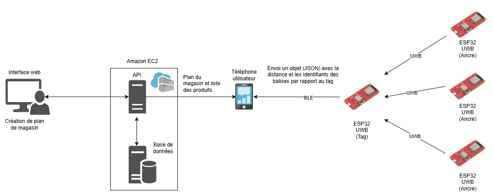
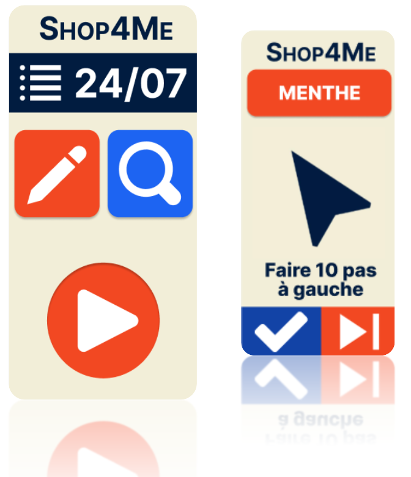

# **ShopForMe Project**

# 🛒 01. Introduction

---

## 1.1 Context

The project aims to design an **innovative connected system** to enhance the **shopping experience** for **visually impaired or blind individuals**. These individuals face daily challenges in stores, often hindering their autonomy.

 **Main Objective:**  
Increase independence by integrating **smart technologies** into the grocery shopping process.

---

## 1.2 ❗ Main Concerns

Visually impaired or blind individuals often struggle with:

-  **Product identification**
-  **Navigation through aisles**
-  **Access to item information**

Our solution — a **connected system** integrated with a **mobile application** — is designed to tackle these challenges by providing **intelligent support** and **seamless access to information**.

---

## 1.3  Project Goals

The primary goal is to develop a **connected system** that:

- Aids in **navigation** within supermarkets  
- Helps locate **specific products**
- Enables users to shop **independently**

✅ The system will be paired with a **dedicated mobile app** for enhanced control and enriched experience.

This project follows an **inclusive design philosophy**, aiming to deliver a **practical and accessible solution** for all.

---

## 1.4  Project Scope

###  Where?

- Inside a **supermarket** (e.g., Carrefour)
- **Large enclosed spaces** with several aisles that **may change layout**
- Presence of **other customers and shopping carts**

###  For Whom?

- 🧑‍🦯 **Blind individuals**
- 👓 **Visually impaired individuals**

# 2. System architecture

- The solution proposed is the one below.

---
# 3. Mobile App 
---

## 4 Useful Links

- 📄 **[Project Documentation](./documentation/)**  
  Access all technical and functional documents related to the project.

- 🗂️ **[GitHub Project Board (Kanban)](https://github.com/users/FredericLEDOUARIN/projects/4)**  
  Track task progress and project organization on GitHub.

---

Together, we aim to **transform the shopping experience** into one that is accessible, independent, and empowering.

